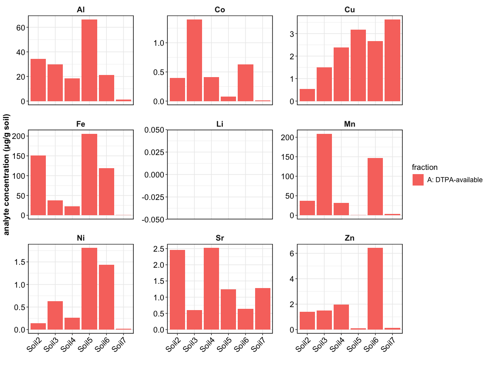
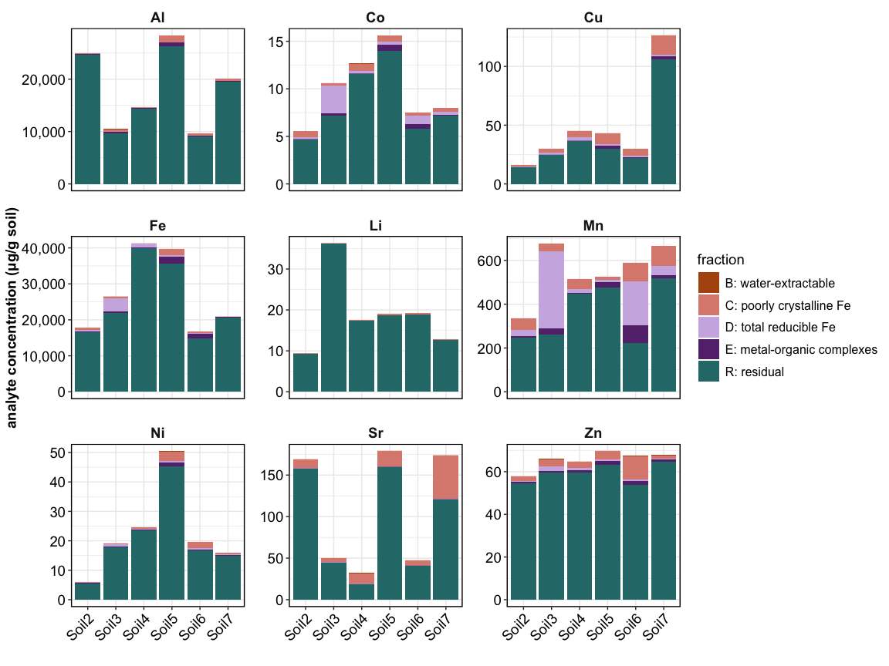
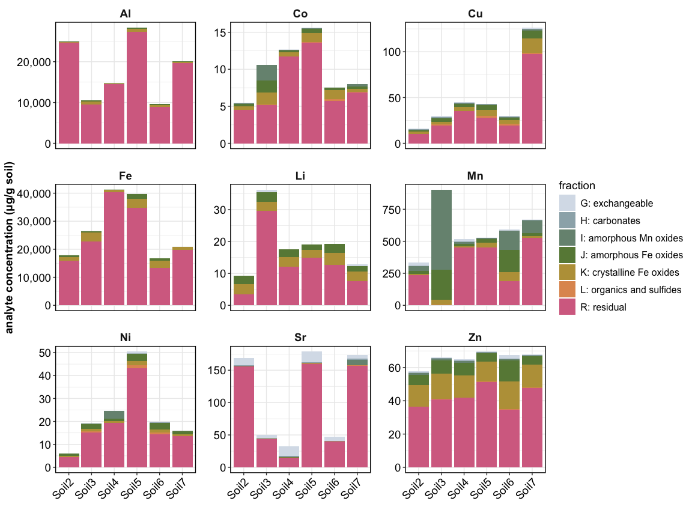
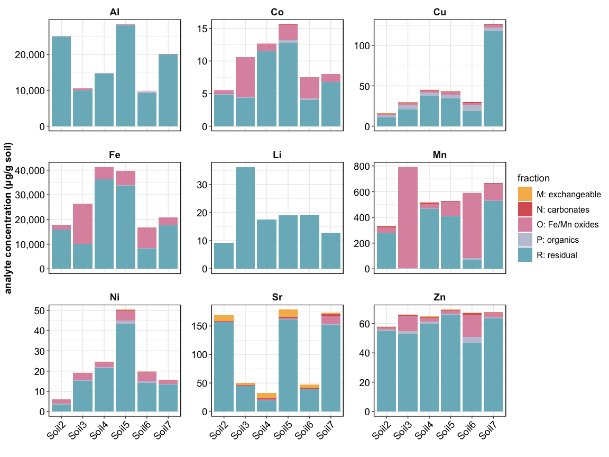
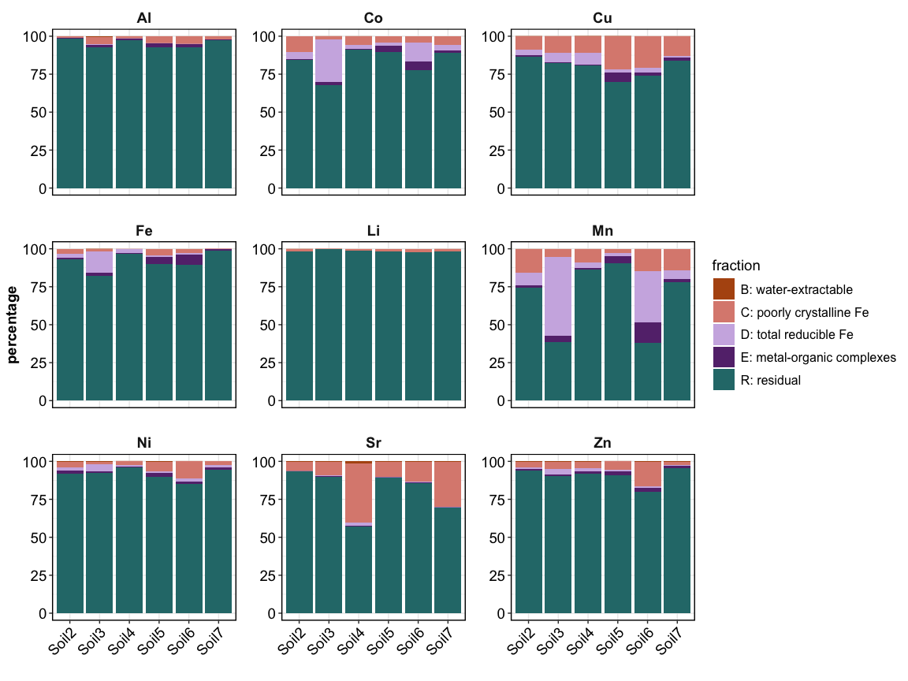
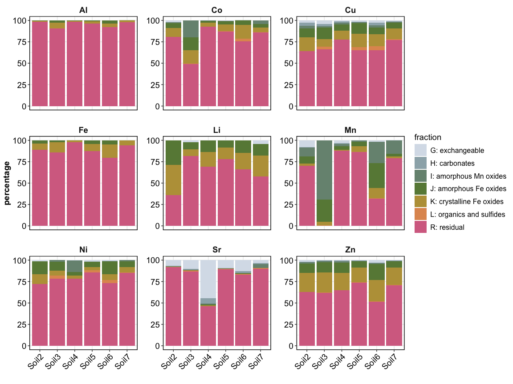
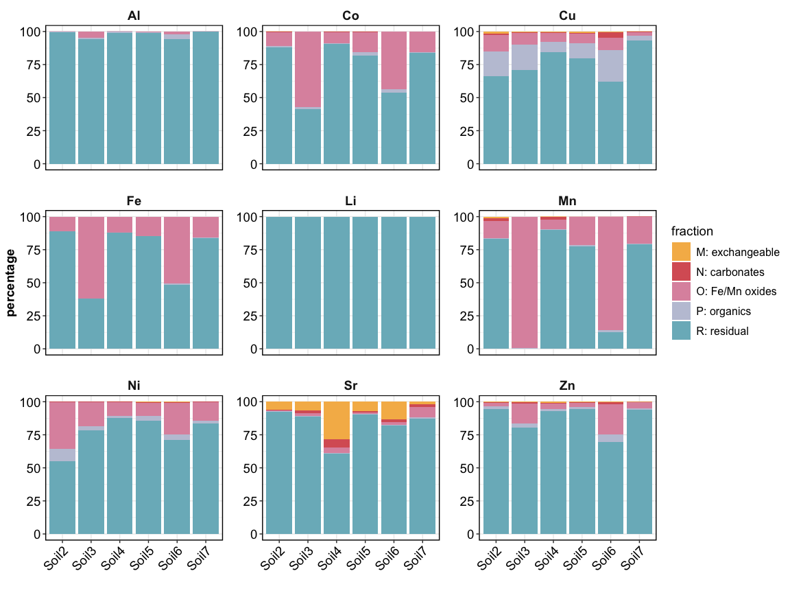
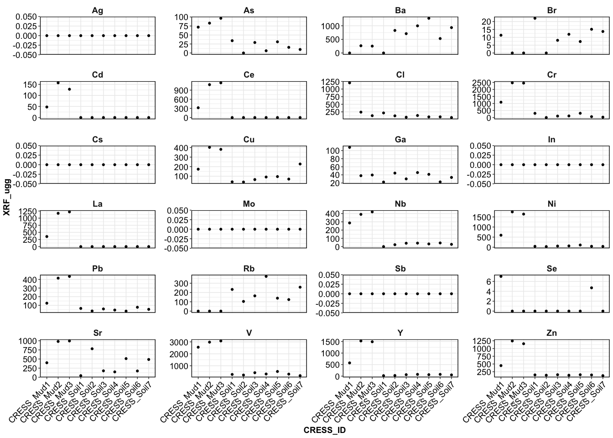
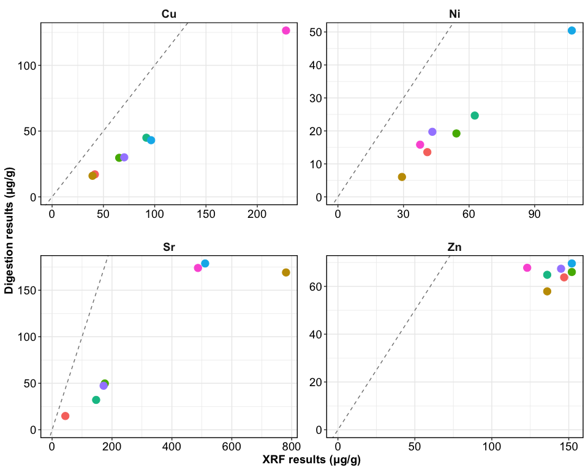

CRESS report for sequential extractions
================

------------------------------------------------------------------------

# Experimental design

Click to open

## Which analytes were measured?

Full list of analytes

| analyte | group           | XRF | ICP |
|:--------|:----------------|:----|:----|
| Al      | cations         |     | Y   |
| Ca      | cations         |     | Y   |
| K       | cations         |     | Y   |
| Mg      | cations         |     | Y   |
| Ag      | CMMs and metals | Y   |     |
| As      | CMMs and metals | Y   |     |
| Ba      | CMMs and metals | Y   | Y   |
| Cd      | CMMs and metals | Y   |     |
| Co      | CMMs and metals |     | Y   |
| Cr      | CMMs and metals | Y   | Y   |
| Cs      | CMMs and metals | Y   |     |
| Cu      | CMMs and metals | Y   | Y   |
| Fe      | CMMs and metals |     | Y   |
| Ga      | CMMs and metals | Y   |     |
| In      | CMMs and metals | Y   |     |
| Li      | CMMs and metals |     | Y   |
| Mn      | CMMs and metals |     | Y   |
| Mo      | CMMs and metals | Y   | Y   |
| Nb      | CMMs and metals | Y   |     |
| Ni      | CMMs and metals | Y   | Y   |
| Pb      | CMMs and metals | Y   |     |
| Rb      | CMMs and metals | Y   |     |
| Sb      | CMMs and metals | Y   |     |
| Se      | CMMs and metals | Y   |     |
| Si      | CMMs and metals |     | Y   |
| Sr      | CMMs and metals | Y   | Y   |
| V       | CMMs and metals | Y   |     |
| Zn      | CMMs and metals | Y   | Y   |
| Br      | Halogen         | Y   |     |
| Cl      | Halogen         | Y   |     |
| Ce      | REEs            | Y   | Y   |
| Dy      | REEs            |     | Y   |
| Er      | REEs            |     | Y   |
| Eu      | REEs            |     | Y   |
| Gd      | REEs            |     | Y   |
| Ho      | REEs            |     | Y   |
| La      | REEs            | Y   | Y   |
| Lu      | REEs            |     | Y   |
| Nd      | REEs            |     | Y   |
| Pr      | REEs            |     | Y   |
| Sc      | REEs            |     | Y   |
| Sm      | REEs            |     | Y   |
| Tb      | REEs            |     | Y   |
| Tm      | REEs            |     | Y   |
| Y       | REEs            | Y   | Y   |
| Yb      | REEs            |     | Y   |

Subset of analytes being discussed here

| analyte | XRF | ICP |
|:--------|:----|:----|
| Al      |     | Y   |
| Co      |     | Y   |
| Cu      | Y   | Y   |
| Fe      |     | Y   |
| Li      |     | Y   |
| Mn      |     | Y   |
| Ni      | Y   | Y   |
| Sr      | Y   | Y   |
| Zn      | Y   | Y   |

------------------------------------------------------------------------

## Extractions performed:

- Single-point DTPA extraction
- “Soil sequence” sequential extraction: water –\> HCl –\> sodium
  dithionite –\> sodium pyrophosphate
- “AMD sequence” (Acid Mine Drainage) sequential extraction
- “Tessier sequence” sequential extraction

Microwave digestions were performed to quantify total concentrations in
the samples. The “residual fraction” was calculated by subtracting total
extractable values (from the sequences) from the digest concentrations.

------------------------------------------------------------------------

## ICP-MS results – ug/g

### DTPA extraction (single point extraction)

This is the bioavailable fraction

<!-- -->

- Sc and Cr were not measured for soil extracts (because the necessary
  standard was not available)
- Li was below detection for all

### Sequential extraction (soil sequence)

<!-- -->

- Sc and Cr were not measured for soil extracts (because the necessary
  standard was not available)

### Sequential extraction (AMD sequence)

<!-- -->

### Sequential extraction (Tessier sequence)

<!-- -->

------------------------------------------------------------------------

------------------------------------------------------------------------

## ICP-MS results – percentage

### Sequential extraction (soil sequence)

<!-- -->

### Sequential extraction (AMD sequence)

<!-- -->

### Sequential extraction (Tessier sequence)

<!-- -->

------------------------------------------------------------------------

# XRF analysis

<!-- -->

## Comparing XRF data with digests

<!-- -->

------------------------------------------------------------------------

------------------------------------------------------------------------

## Session Info

Session Info

Date run: 2026-04-09

    ## R version 4.5.0 (2025-04-11)
    ## Platform: aarch64-apple-darwin20
    ## Running under: macOS 26.3.2
    ## 
    ## Matrix products: default
    ## BLAS:   /Library/Frameworks/R.framework/Versions/4.5-arm64/Resources/lib/libRblas.0.dylib 
    ## LAPACK: /Library/Frameworks/R.framework/Versions/4.5-arm64/Resources/lib/libRlapack.dylib;  LAPACK version 3.12.1
    ## 
    ## locale:
    ## [1] en_US.UTF-8/en_US.UTF-8/en_US.UTF-8/C/en_US.UTF-8/en_US.UTF-8
    ## 
    ## time zone: America/New_York
    ## tzcode source: internal
    ## 
    ## attached base packages:
    ## [1] stats     graphics  grDevices utils     datasets  methods   base     
    ## 
    ## other attached packages:
    ##  [1] whistledown_0.1.0   googlesheets4_1.1.1 lubridate_1.9.4    
    ##  [4] forcats_1.0.0       stringr_1.5.1       dplyr_1.2.0        
    ##  [7] purrr_1.0.4         readr_2.1.5         tidyr_1.3.2        
    ## [10] tibble_3.3.1        ggplot2_4.0.2       tidyverse_2.0.0    
    ## 
    ## loaded via a namespace (and not attached):
    ##  [1] rappdirs_0.3.3     generics_0.1.3     stringi_1.8.7      hms_1.1.3         
    ##  [5] digest_0.6.37      magrittr_2.0.3     evaluate_1.0.3     grid_4.5.0        
    ##  [9] timechange_0.3.0   RColorBrewer_1.1-3 fastmap_1.2.0      cellranger_1.1.0  
    ## [13] jsonlite_2.0.0     googledrive_2.1.1  httr_1.4.7         scales_1.4.0      
    ## [17] cli_3.6.5          rlang_1.1.7        withr_3.0.2        yaml_2.3.10       
    ## [21] tools_4.5.0        tzdb_0.5.0         gargle_1.5.2       curl_6.2.2        
    ## [25] vctrs_0.7.1        R6_2.6.1           lifecycle_1.0.5    fs_1.6.6          
    ## [29] pkgconfig_2.0.3    pillar_1.10.2      gtable_0.3.6       glue_1.8.0        
    ## [33] xfun_0.53          tidyselect_1.2.1   rstudioapi_0.17.1  knitr_1.50        
    ## [37] farver_2.1.2       htmltools_0.5.8.1  labeling_0.4.3     rmarkdown_2.29    
    ## [41] compiler_4.5.0     S7_0.2.0           askpass_1.2.1      openssl_2.3.2

